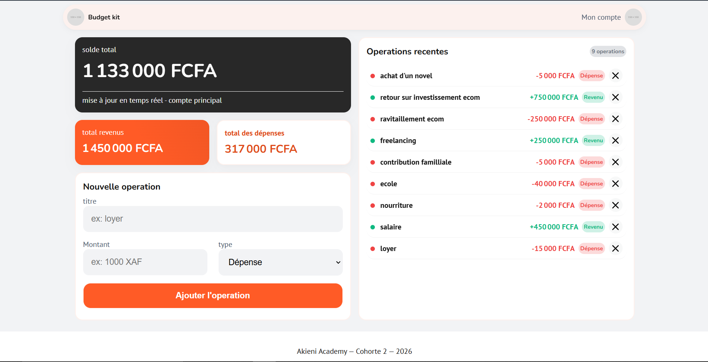

# Budget kit - application de gestion de budget

> Application de gestion de budget destiné à l'usage personnel
> _projet 10.3 - cohorte 2 Akieni academy_


# Overview

Budget kit est une application web légère et responsive de gestion de budget, elle permet d'ajouter et efface nos dépenses et revenu puis de donner le solde, le total des dépenses ainsi que des revenu le tout mis à jour en temps réel et enregistrer dans `LocalStorage`.



# Fonctionnalités

- **Tableau de bord dynamique (KPIs) :**
  - Affichage du solde total, du total des revenus et du total des dépenses.
  - Mise à jour automatique des calculs à chaque ajout ou suppression.
- **Gestion des opérations :**
  - Ajout d'une opération (titre, montant, type : revenu ou dépense).
  - Génération automatique d'un identifiant unique (ID aléatoire à 6 caractères).
  - Suppression d'une opération avec recalcul immédiat des totaux.
- **Persistance des données :**
  - Sauvegarde automatique dans le `localStorage` du navigateur.
- **Mise en forme :**
  - Formatage monétaire automatique au format XAF (Franc CFA) via l'API `Intl.NumberFormat`.


# Technologies utilisées

- **HTML5** : Structure sémantique du formulaire et du tableau de bord.
- **CSS3** : Variables CSS, mise en page responsive et classes d'état (revenu/dépense).
- **JavaScript (ES6+)** : Manipulation du DOM, gestion des événements, algorithme de génération d'ID récursif, persistance `localStorage`.


# structure des objet opération

Chaque opération est stockée est stocké dans un tableau qui lui est enregistré dans `Local storage`

```json
{
  "id": "a1b2c3",
  "title": "Salaire",
  "amount": 250000,
  "type": 2
}
```


# Architecture du projet

```text
projet10.3-calculateur-de-budget/
├── assets/
│   ├── img/            # Images et icônes statiques du projet (ex: favicons)
│   └── styles/
│       └── style.css   # Feuille de style globale (variables CSS, layout, composants)
├── .gitignore          # Fichiers et dossiers ignorés par Git
├── index.html          # Structure HTML principale de la plateforme
├── script.js           # Logique JavaScript (manipulation DOM, événements, localStorage)
└── README.md           # Documentation du projet
```


# Demo

[lien vers la demo live](https://yggdrasil2024.github.io/projet10.3-alculateur-de-budget/)


# auteur

**BIKOUTA Guyverna**
